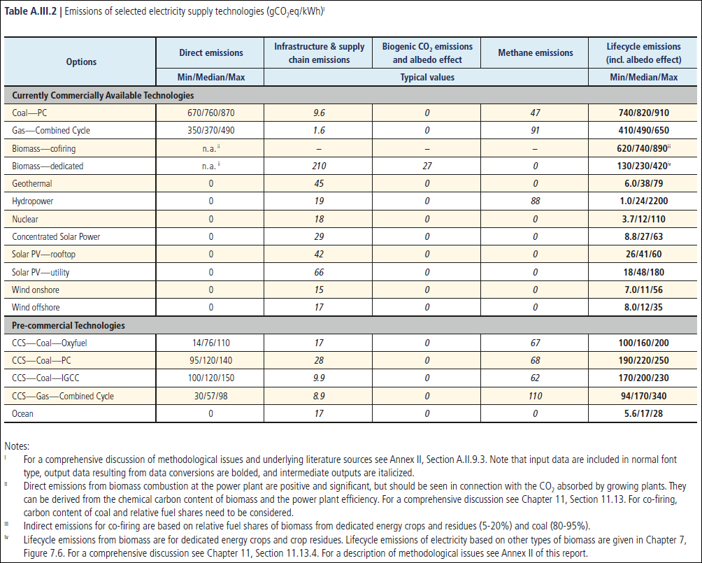
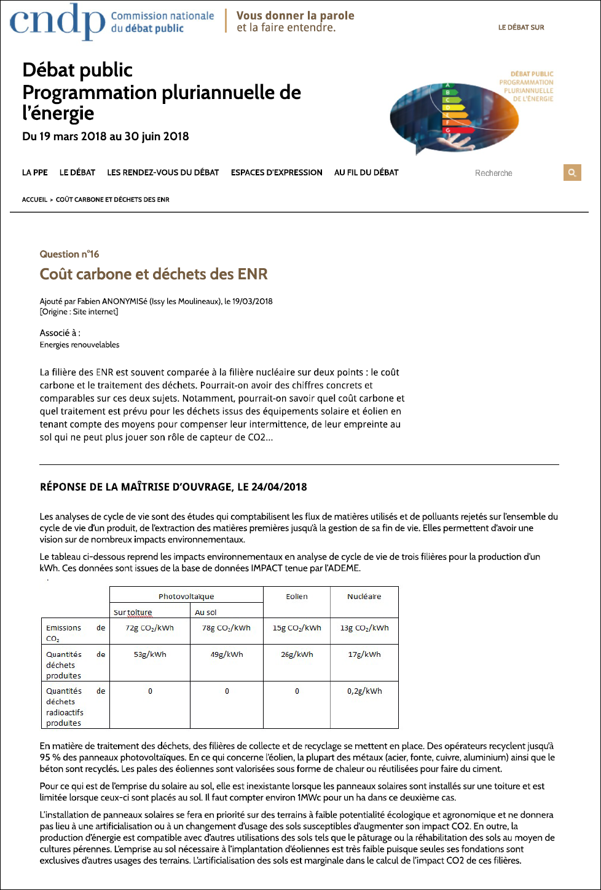

## Quelle quantité de CO2 le photovoltaïque, l'éolien et le nucléaire émettent-ils ?

Cette page s'intéresse aux émissions de CO2 par quantité d'énergie électrique produite sur l'ensemble du cycle de vie, pour les filières photovoltaïque, éolienne et nucléaire.

### Synthèse

Qu'il s'agisse des données globales du GIEC, ou de l'ADEME pour la France, il ressort que les émissions de CO2 par kWh produit sur l'ensemble du cycle de vie sont équivalentes pour l'éolien et le nucléaire (de l'ordre de la douzaine de grammes), et environ 4 à 5 fois plus importantes pour le photovoltaïque. Pour l'éolien et le photovoltaïque, ces chiffres ne tiennent compte que de la partie production, mais pas des moyens de stockages additionnels généralement nécessaires pour contrebalancer l'intermittence de ces sources. Globalement, ces valeurs restent très faibles comparées à d'autres sources d'énergies (820g pour le charbon, par exemple, selon les chiffres du GIEC).

### Sommaire  
[Valeurs générales compilées par le GIEC](#valeurs-générales-compilées-par-le-giec)  
[Valeurs pour la France fournies par l'ADEME](#valeurs-pour-la-france-de-lademe)

### Valeurs générales compilées par le GIEC

Le GIEC (Groupe d’experts intergouvernemental sur l’évolution du climat), ou IPCC en anglais (Intergovernmental Panel on Climate Change), est une comission scientifique de l'ONU fondée en 1988.

> « *[Il] est le principal organe international chargé d’évaluer le changement climatique. Il a été créé par le Programme des Nations Unies pour l’environnement (PNUE) et par l’Organisation météorologique mondiale (OMM) pour fournir au monde une vision scientifique claire de l’état actuel des connaissances en matière de changements climatiques et de leur incidence potentielle sur l’environnement et la sphère socio-économique. La même année, l’Assemblée générale des Nations Unies approuvait cette initiative de l’OMM et du PNUE.*
> 
> *Le GIEC est un organe scientifique. Il a pour mission d’examiner et évaluer les données scientifiques, techniques et socio-économiques les plus récentes publiées dans le monde et utile à la compréhension des changements climatiques. Il n’est pas chargé de conduire des travaux de recherche, ni de suivre l’évolution des données ou paramètres climatologiques.* »
>
> *Source : [Site de l'IPCC](https://www.ipcc.ch/languages-2/francais/)*

L'une des principales production du GIEC est le Rapport d'Evaluation (*Assesement Report*) sur le changement cimatique. Le dernier en date "Changements climatiques 2014 - Atténuation du changement climatique" a été publié en 2014 (1454 pages, [lien](https://www.ipcc.ch/report/ar5/wg3/)). Le prochain Rapport d'Evaluation est prévu pour 2022.

Dans le rapport complet (Full Report) de 2014 figure, en annexe III, le tableau A.III.2 (page 1335) compilant les valeurs d'émission des différentes fillères de production exprimées en gCO2eq / kWh (en gramme équivalent CO2 par kilowatt-heure donc). Ce tableau est le suivant :

La dernière colonne du tableau donne les valeurs d'émissions minimales, médianes et maximales relevées dans les publications scientifiques, sur l'ensemble du cycle de vie des différentes fillières de production. Ainsi, les valeurs médianes pour les différentes filières sont les suivantes :

Filière                                       | Emissions sur le cycle de vie (en gCO2eq/kWh)
--------------------------------------------- | :-------------------------------------------:
Nucléaire                                     | 12
Photovoltaïque (sur toiture)                  | 41
Photovoltaïque (centrale raccordée au réseau) | 48
Eolien terrestre                              | 11
Eolien en mer                                 | 12

Globalement, le nucléaire et l'eolien sont au même niveau en matière d'émissions, et le photovoltaïque produit 4 fois plus de CO2 sur son cycle de vie à kWh produit équivalent.

Il faut remarquer que ces valeurs correspondent uniquement à la **production** d'électricité : si le nucléaire est pilotable, le solaire et l'éolien peuvent nécessiter des moyens de **stockage** additionnels afin de disposer de l'énergie produite quand celle-ci est utile. Le coût en CO2 de ces moyens de stockage sur leur cycle de vie n'est pas pris en compte dans ces valeurs.

### Valeurs pour la France de l'ADEME

A l'occasion du débat public organisé dans le cadre de la Programmation Pluriannuelle de l'Energie 2020 (voir Décret n° 2020-456 du 21 avril 2020 relatif à la programmation pluriannuelle de l'énergie), qui s'est tenu du 18 mars 2018 au 30 juin 2018, la question des émissions (et déchets) des filières solaire, éolien et nucléaire a été posée.

La réponse fournie s'appuie sur les chiffres de la base de donnée IMPACTS de l'ADEME (L'Agence de la transition écologique, anciennement Agence De l'Environnement et de la Maîtrise de l'Energie qui lui a donné son acronyme). L’ADEME est un établissement public sous la tutelle du ministère de la Transition écologique et solidaire et du ministère de l’Enseignement supérieur, de la Recherche et de l’Innovation.

> « *La Base IMPACTS ® est la base de données génériques d'inventaire officielle pour le programme gouvernemental français d'affichage environnemental des produits de grande consommation. Elle est complémentaire aux référentiels sectoriels élaborés dans le cadre de la "plateforme ADEME-AFNOR" (http://affichage-environnemental.afnor.org/).*
>
> *Les jeux de données d'inventaire de la Base IMPACTS ® sont directement caractérisés en indicateurs d'impact potentiel selon l'approche ACV (Analyse de Cycle de Vie), via les méthodes de caractérisation préconisées par le JRC (Joint Research Center, centre de recherche de la Commission Européenne) dans l'ILCD Handbook (http://lct.jrc.ec.europa.eu/assessment/pdf-directory/Recommendation-of-methods-for-LCIA-def.pdf)* »
>
> *Source : [Documentation base IMPACTS](https://www.bilans-ges.ademe.fr/documentation/UPLOAD_DOC_FR/index.htm?base_impact.htm)*

La question posée et la réponse fournie sur le site du débat public sont visible sur la capture d'écran suivante ([lien original](https://cpdp.debatpublic.fr/cpdp-ppe/cout-carbone-dechets-enr.html)) :

Ainsi, les valeurs d'émission de gCO2 par kWh d'énergie produite sur la durée du cycle de vie pour ces différentes filières de production d'électricité sont :

Filière                      | Emissions sur le cycle de vie (en gCO2/kWh)
---------------------------- | :-----------------------------------------:
Nucléaire                    | 13
Eolien                       | 15
Photovoltaïque (sur toiture) | 72
Photovoltaïque (au sol)      | 78

Les ordres de grandeur de ces chiffres sont globalement analogues à ceux du GIEC, mais les valeurs d'émission pour le photovoltaïque sont légèrement supérieures. Et comme pour les données du GIEC, il faut remarquer que ces valeurs correspondent uniquement à la **production** d'électricité : si le nucléaire est pilotable, le solaire et l'éolien peuvent nécessiter des moyens de **stockage** additionnels afin de disposer de l'énergie produite quand celle-ci est utile. Le coût en CO2 de ces moyens de stockage sur leur cycle de vie n'est pas pris en compte dans ces valeurs.
