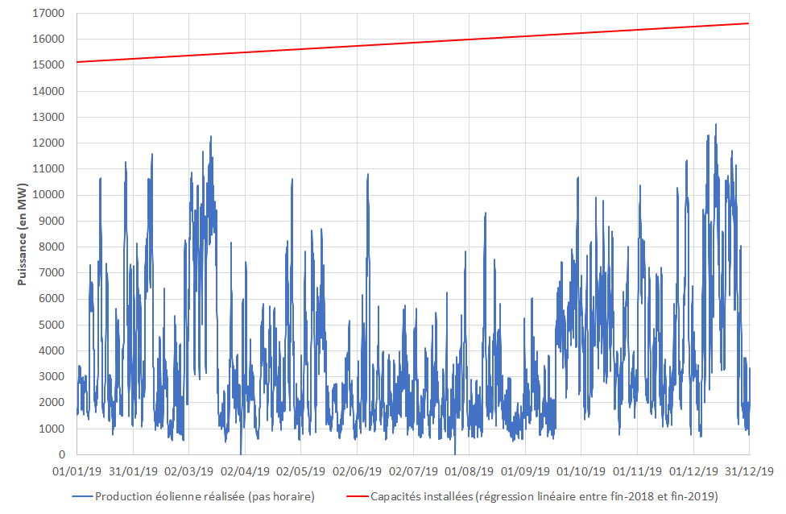
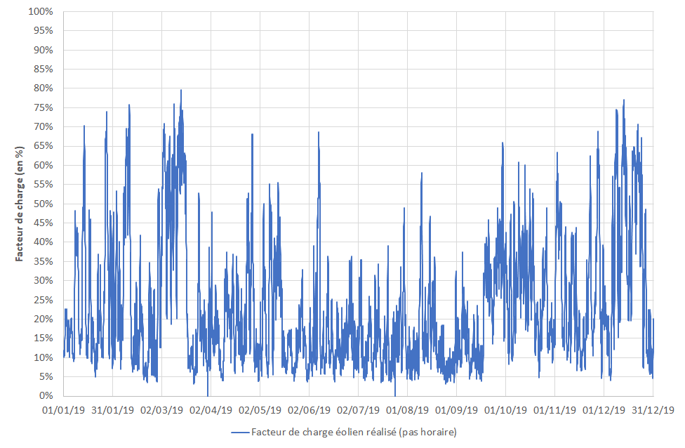
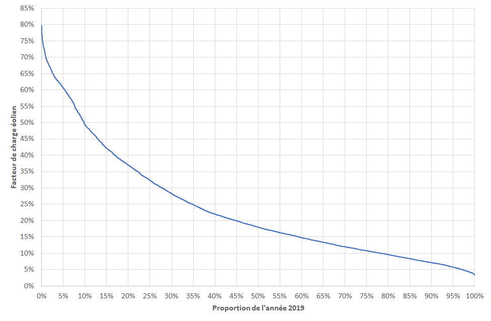

## Quelle puissance le parc éolien français a-t-il délivré en 2019 ?

L'analyse porte sur la puissance délivrée par le parc éolien français et son facteur de charge observé sur l'année 2019.

### Synthèse

La capacité installée du parc éolien est passé de 15 117 MW fin 2018 à 16 617 MW fin 2019.

Le parc éolien a fournit une puissance moyenne de 3 735 MW sur l'année, soit environ 23,5 % de la puissance installée. La puissance délivrée a ainsi été supérieure à 50 % de la capacité installée pendant 10 % de l'année. Elle a également été supérieure à un quart de la puissance installée pendant un tiers de l'année.

La puissance minimale injectée par le parc éolien sur une heure donnée a été de 521 MW, soit environ 3,5 % de la capacité installée. La puissance maximale injectée a été de 12 742 MW, soit 76,7 % de la capacité installée.

### Données utilisées

Les données de production éolienne utilisées sont issues du jeu de données "Production réalisée agrégée par filière" mis à disposition par Rte ([lien](https://www.services-rte.com/fr/visualisez-les-donnees-publiees-par-rte/production-realisee-agregee-par-filiere.html)), pour la période du 01/01/2019 au 31/12/2019. Ces données de puissance moyenne sont au pas horaire. Ces données de production éolienne comportent 7 valeurs manquantes sur 8760 valeurs au total (365 jours * 24 heures), soit 0,08 % de valeurs manquantes.

Les informations sur les capacités éoliennes installées en France au 31/12/2018 (15 117 MW) et au 31/12/2019 (16 617 MW) sont issues des "Tableaux de bord : éolien" du SDES (Service de la donnée et des études statistiques) ([lien](https://www.statistiques.developpement-durable.gouv.fr/tableau-de-bord-eolien-deuxieme-trimestre-2020?rubrique=21&dossier=172)).

### Analyse

La chronique de production d'origine éolienne réalisée en France en 2019 présente l'allure suivante (la droite en rouge représentant la capacité installée est obtenue par régression linéaire entre les valeurs à fin 2018 et à fin 2019) :

La puissance moyenne injectée sur l'année a été de 3 735 MW, pour une puissance installée d'environ 15 867 MW (moyenne entre les valeurs à fin 2018 et à fin 2019).

En divisant la puissance réalisée à chaque pas horaire par la valeur de la puissance installée correspondante, on obtient l'évolution du facteur de charge horaire sur l'année :

Le facteur de charge horaire moyen sur l'année a été de 23,5 %.

En ordonnant les 8 760 (365 * 24) valeurs de facteur de charge horaire par ordre décroissant, on obtient la monotone du facteur de charge sur l'année 2019 :

Ce graphique permet de déterminer la proportion du temps de l'année 2019 où le facteur de charge a été supérieur à une valeur donnée. Ainsi, partant de l'axe vertical, on peut lire que la puissance injectée a été supérieure à la moitié de la puissance installée pendant 10% de l'année (intersection sur la courbe de la valeur 50% sur l'axe vertical avec la valeur 10% sur l'axe horizontal). De façon analogue, la puissance produite a été supérieure au quart de la puissance installée pendant un tiers de l'année.
